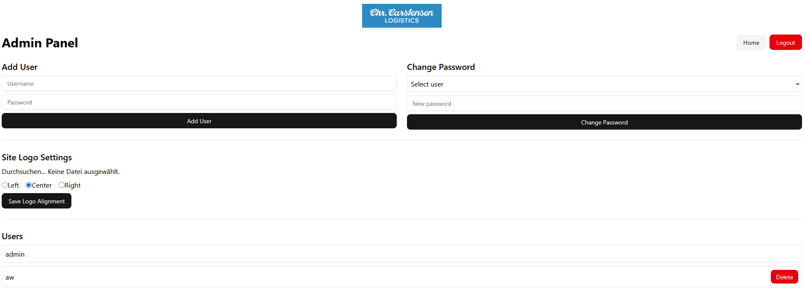
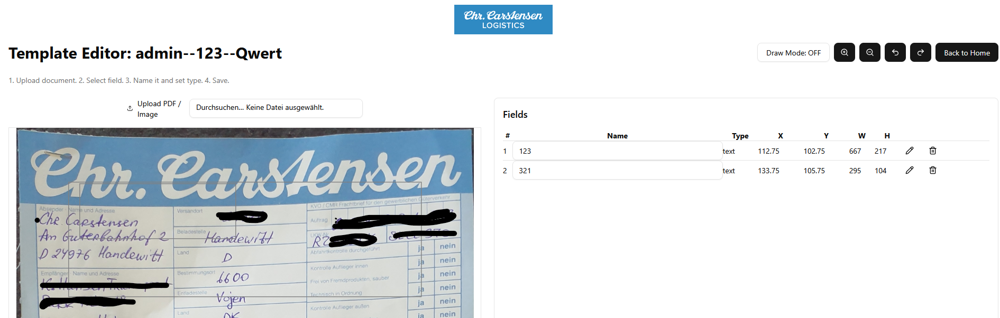

README
======

OCR Template Editor Web App
---------------------------

**English Description**

This is a web-based template editor for an OCR (Optical Character Recognition) service. It allows authenticated users to upload documents, draw field regions, annotate them with labels and types, and save the annotated template for use in data extraction.

### Features

- **Login system** with role-based access (admin/user)
- **Admin Panel** to manage users and upload the site logo with alignment settings
- **Home Page** listing saved templates (with sorting & filtering)
- **Template Editor** to:
  - Upload PDF or image
  - Draw bounding boxes for fields
  - Annotate fields with name and type (text/image/number)
  - Save template as JSON and export preview PNG
  - Zoom in/out and undo/redo changes
- **Dynamic logo** appears on all pages with alignment configurable in the admin panel

### Technologies

- Next.js (App Router)
- React + Hooks
- TypeScript
- TailwindCSS
- PDF.js

### Folder Structure

```
app/
├── admin/         # Admin panel for user management & logo upload
├── login/         # Login screen
├── home/          # Template list & navigation
├── templates/     # Main template editor
├── components/    # SiteLogo and UI components
```

### Screenshots

#### Login


#### Admin Panel


#### Home Page


#### Template Editor



---

**Deutsche Beschreibung**

Dies ist eine webbasierte Vorlage-Editor-Anwendung für einen OCR-Service (Optische Zeichenerkennung). Benutzer können Dokumente hochladen, Felder markieren, benennen und speichern, um Daten automatisch extrahieren zu können.

### Funktionen

- **Login-System** mit Benutzerrollen (admin/nutzer)
- **Admin-Bereich** zur Benutzerverwaltung und Logo-Upload mit Ausrichtung
- **Startseite** mit Liste gespeicherter Vorlagen (Filtern & Sortieren)
- **Vorlagen-Editor** mit:
  - PDF-/Bild-Upload
  - Zeichnen von Feldern
  - Benennung & Typauswahl (Text/Bild/Zahl)
  - Speichern als JSON + PNG-Vorschau
  - Zoom + Undo/Redo
- **Dynamisches Logo** auf allen Seiten einblendbar und ausrichtbar

### Technologien

- Next.js (App Router)
- React + Hooks
- TypeScript
- TailwindCSS
- PDF.js

### Ordnerstruktur

```
app/
├── admin/         # Adminbereich für Benutzerverwaltung & Logo
├── login/         # Anmeldeseite
├── home/          # Vorlagen-Liste
├── templates/     # Editor zur Felderfassung
├── components/    # SiteLogo und UI-Komponenten
```

### Screenshots

#### Anmeldung


#### Admin-Bereich


#### Startseite


#### Editor


---

**To run the app locally:**
```bash
npm install
npm run dev
```

**To build:**
```bash
npm run build
```

**License:** MIT
